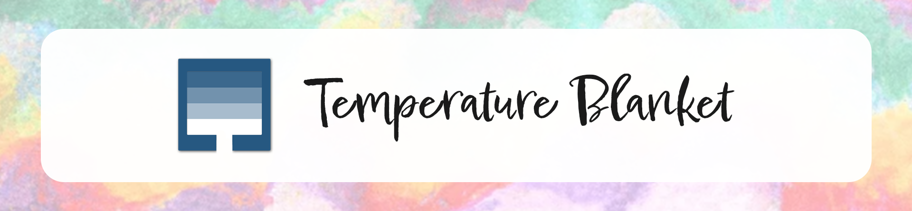

### 🌤️ Weather Data + 🧶 Art!

Website: **[temperature-blanket.com](https://temperature-blanket.com)**

Visualize your city's historical climate data, create color gauges, and preview your pattern for your crochet or knitting temperature project. Save your project in your browser and as a URL, and download project information in PDF, CSV, and PNG files.

Built with:

- [Svelte 5 & Sveltekit 2](https://svelte.dev/)
- [Skeleton 4](https://github.com/skeletonlabs/skeleton)
- [Tailwind 4](https://github.com/tailwindlabs/tailwindcss)

## 🚀 Getting Started

To run this site locally on your computer for development, [clone this repository](https://docs.github.com/en/repositories/creating-and-managing-repositories/cloning-a-repository) and create a `.env` file. Additionally, in order for certain features to work you'll need to register for some free API services.

> 💡 [Node.js](https://nodejs.org/en/download/package-manager) must be installed on your machine.

1. Copy the [.env.example](.env.example) file to a new file named `.env` in the root directory of your project.

2. For the location search features to work, [register for a free GeoNames username](http://www.geonames.org/login). You will then receive an email with a confirmation link and after you have confirmed the email you can enable your account for the webservice on [your account page](http://www.geonames.org/manageaccount). In your `.env` file, set `SECRET_GEONAMES_USERNAME` to your GeoNames username. The free plan gets 10,000 credits per month.

3. For the Meteostat weather data features to work, [sign up for the free Meteostat Base plan through RapidAPI](https://rapidapi.com/meteostat/api/meteostat/pricing). In your `.env` file, set `SECRET_METEOSTAT_API_KEY` to your key from RapidAPI. The free Base plan gets 500 requests per month.

## 🛠️ Developing

Install dependencies:

```bash
pnpm install
```

Start a development server:

```bash
pnpm dev
```

#### Local Cloudflare bindings (accounts)

`wrangler.jsonc` gives local development a D1 database (`DB`) and an R2 bucket (`PROJECTS`), stored under `.wrangler/state`. It has no `pages_build_output_dir`, so Cloudflare Pages ignores it for deployed builds; production bindings are set in the Pages dashboard. `pnpm dev`, `pnpm preview` and `wrangler pages dev` all use it.

Apply database migrations (from `migrations/`) to the local database:

```bash
pnpm db:migrate:local
```

It also enables dev-only routes, which return 404 anywhere `ENABLE_DEV_ROUTES` isn't `"true"`:

- `/api/dev/platform` checks the D1 and R2 bindings.
- `/api/dev/outbox?to=<address>` lists emails "sent" by the fake sender (`EMAIL_SENDER=dev-outbox`), which stores them in the local R2 bucket instead of sending.

#### Accounts

Accounts use [Better Auth](https://www.better-auth.com) (pinned to an exact version) on D1, with sign-in by emailed code; there are no passwords. Its API is `/api/auth/*`, loaded only for those requests. The UI (`/auth/sign-in`, `/account` and the Account link) is built in only when `PUBLIC_ACCOUNTS_ENABLED=true` at build time; `pnpm test:e2e:cloudflare` builds with it on.

Server settings, read from the Cloudflare environment (local values are in `wrangler.jsonc`):

| Variable                                   | Purpose                                                                                                                                                               |
| ------------------------------------------ | --------------------------------------------------------------------------------------------------------------------------------------------------------------------- |
| `ACCOUNTS_ENABLED`                         | `"true"` turns on `/api/auth/*`; anything else returns 404                                                                                                            |
| `BETTER_AUTH_SECRET`                       | At least 32 characters; signs session cookies. Set as an encrypted secret in production                                                                               |
| `AUTH_ALLOWED_HOSTS`                       | Comma-separated hosts the app is served on, e.g. `temperature-blanket.com` or `*.<project>.pages.dev` for previews                                                    |
| `AUTH_PROTOCOL`                            | `https` (default), `http`, or `auto`                                                                                                                                  |
| `EMAIL_SENDER`                             | `resend`, or `dev-outbox` locally (only allowed where `ENABLE_DEV_ROUTES` is `"true"`, since anyone can read the outbox). Anything else turns accounts off with a 503 |
| `RESEND_API_KEY`, `EMAIL_FROM`             | For `resend`: an API key (as a secret) and the from-address, e.g. `Temperature Blanket <sign-in@mail.temperature-blanket.com>`                                        |
| `GOOGLE_CLIENT_ID`, `GOOGLE_CLIENT_SECRET` | Optional: turns on “Continue with Google”. Redirect URI: `<site>/api/auth/callback/google`                                                                            |
| `ACCOUNTS_SIGNUP_LIMIT`                    | Optional: the most accounts there may be. Unset means no limit, `0` closes sign-ups. Existing accounts keep signing in either way                                     |

Secrets for local development (for example real Google credentials) go in `.dev.vars`, which wrangler reads and git ignores.

Saved projects, palettes and some preferences sync to the signed-in account through `/api/sync` (metadata, palettes and preferences in D1, gzipped project JSON in R2; see `src/lib/sync/protocol.ts`). The server needs `SYNC_ENABLED=true` and the `PROJECTS` R2 binding; every account may sync.

To try accounts in the dev server, run `pnpm dev:accounts` (`pnpm dev` with `PUBLIC_ACCOUNTS_ENABLED=true`). No real email is sent: open `/api/dev/outbox?to=<email>` to read the code. It works over HTTPS on the tailnet too (`AUTH_ALLOWED_HOSTS` allows `*.ts.net:5173`). For Google, put `GOOGLE_CLIENT_ID` and `GOOGLE_CLIENT_SECRET` in `.dev.vars`, add `https://<host>:5173/api/auth/callback/google` as a redirect URI on the Google client, and restart the dev server.

After changing Better Auth plugins or options, generate the matching migration and apply it:

```bash
node scripts/generate-auth-migration.ts <name>
pnpm db:migrate:local
```

### ✅ Testing

First build the app (to generate cloudflare \_routes.json file)

```bash
pnpm build
```

Unit tests (for functions)

```bash
pnpm test:unit
```

Integration tests (for the yarn colorway api route)

```bash
pnpm test:integration
```

End-to-end tests (for pages and ui flows)

```bash
pnpm test:e2e
```

End-to-end tests against the Cloudflare build under `wrangler pages dev`, which honors `_routes.json` and provides the local D1 and R2 bindings (also checks every static route is prerendered)

```bash
pnpm test:e2e:cloudflare
```

Run all tests (unit, integration, and end-to-end)

```bash
pnpm test
```

## 🙌 Acknowledgments

Thanks for the support and feedback from users like you!

Temperature-blanket.com gets data from several APIs:

- **[GeoNames](https://www.geonames.org/)** for location data

- **[Open-Meteo](https://open-meteo.com)** for weather data

- **[Meteostat](https://meteostat.net)** for weather data

# 📚 Documentation & Notes

### 🗄️ Database

Temperature-blanket.com uses a backend database in the form of a headless Wordpress site on a separate domain to store user-created gallery pages.

<details>
<summary>View Details</summary>

> ℹ️ The information below is intended for documentation only. You can test and develop this project locally without setting up your own backend database.

Here are the steps for setting up the headless Wordpress site:

- Install Wordpress on a separate domain.
- I use the following plugins
  - [EWWW Image Optimizer](https://wordpress.org/plugins/ewww-image-optimizer/) - To compress and optimize project preview images
  - [Redirection](https://wordpress.org/plugins/redirection/) - To redirect the headless Wordpress home page to the temperature-blanket.com site, and to redirect project pages to their corresponding gallery pages on temperature-blanket.com.
  - Temperature Blanket Custom Plugin - I created a Wordpress plugin which handles the necessary setup and allows for creation of project gallery pages through a custom REST endpoint. The source code for this plugin is not public, but if you are interested you can reach out to me.
  - [Wordfence](https://wordpress.org/plugins/wordfence/) - For general site security
  - [Wordpress Popular Posts](https://wordpress.org/plugins/wordpress-popular-posts/) - For tracking popular project gallery pages
  - [WP-GraphQL](https://wordpress.org/plugins/wp-graphql/) - For interacting with the Wordpress backend
- Add the following line to `wp-config.php`:

```
define('PROJECT_CREATION_AUTH_KEY', 'auth_key');
```

- In this project's `.env` file, `SECRET_WORDPRESS_PROJECT_CREATION_AUTH_KEY` should be the same `'auth_key'` value. Without the correct auth key, the Wordpress site won't accept POST requests for new project gallery pages.

> 💡 When developing locally, POST requests to create new temperature blanket project gallery pages will be rejected. This is normal, because you don't have the necessary authentication key.

</details>

### 💾 Local Storage

Settings and user preferences are stored in the browser's Local Storage.

<details>
<summary>View Details</summary>

| Key Name              | Description                                                                                                                                                                                                          | Default Value                                                                                                                                                                                                                     | Possible Values                                                      | Version Added\*          |
| --------------------- | -------------------------------------------------------------------------------------------------------------------------------------------------------------------------------------------------------------------- | --------------------------------------------------------------------------------------------------------------------------------------------------------------------------------------------------------------------------------- | -------------------------------------------------------------------- | ------------------------ |
| preferences           | User preferences object                                                                                                                                                                                              | `{ disableToastAnalytics: false, layout: 'list', seasons: [...DEFAULT_SEASONS], theme: { id: 'classic', mode: 'system', roundness: 'pill', spacing: 'normal', textScale: 'normal', headingStyle: 'classic' }, units: 'imperial'}` | [`LocalStatePreferencesType`](src/lib/storage/preferences.svelte.ts) | 5.0.0                    |
| [/weather]units       | Units for the weather forecast page                                                                                                                                                                                  | `imperial`                                                                                                                                                                                                                        | `imperial`, `metric`                                                 | < 3.28.3                 |
| [/weather]hour_format | Time format for the weather forecast page                                                                                                                                                                            | `12`                                                                                                                                                                                                                              | `12`, `24`                                                           | < 3.28.3                 |
| [/weather]locations   | Locations the user has added for the weather forecast page                                                                                                                                                           | `[]`                                                                                                                                                                                                                              | array of [`Location`](src/lib/types/location-types.d.ts) objects     | < 3.28.3                 |
| preferences_sync      | When each synced preference last changed on this device and which of those changes the signed-in account has, so the newest change to each wins (changes are noted signed out too)                                   | none                                                                                                                                                                                                                              | [`PreferencesSyncState`](src/lib/storage/preferences-sync.svelte.ts) | unreleased (after 6.3.2) |
| tb_account            | The signed-in person's account ID, name, email and picture, so the navigation can show them and saved projects know their account. Removed when the session ends                                                     | none                                                                                                                                                                                                                              | [`AccountSummary`](src/lib/accounts/summary.svelte.ts)               | unreleased (after 6.3.2) |
| yarn_uses             | How many times colors from each yarn have been saved (from Choose Colorways, Random, and From an Image), and the yarns not to suggest again, to suggest making a favorite yarn the default. Kept on this device only | none                                                                                                                                                                                                                              | [`YarnUsesState`](src/lib/storage/yarn-uses.svelte.ts)               | unreleased (after 6.3.2) |
| accounts_intro        | Whether the signed-out account button's "New" dot has been used and the notice offering an account after a first save has been shown, so each introduces accounts (in beta) once. Kept on this device only           | none                                                                                                                                                                                                                              | [`AccountsIntroState`](src/lib/storage/accounts-intro.svelte.ts)     | unreleased (after 6.3.2) |

**`preferences.theme` fields:**

| Field          | Description                     | Default     | Options                                                                      |
| -------------- | ------------------------------- | ----------- | ---------------------------------------------------------------------------- |
| `id`           | Color palette                   | `'classic'` | `'classic'`, `'crimson'`, `'hamlindigo'`, `'modern'`, `'rocket'`, `'legacy'` |
| `mode`         | Light/dark mode                 | `'system'`  | `'light'`, `'dark'`, `'system'`                                              |
| `roundness`    | Button/container corner radius  | `'pill'`    | `'sharp'`, `'rounded'`, `'pill'`                                             |
| `spacing`      | Layout density                  | `'normal'`  | `'compact'`, `'normal'`, `'relaxed'`                                         |
| `textScale`    | Typographic scale ratio         | `'normal'`  | `'small'`, `'normal'`, `'large'`                                             |
| `headingStyle` | Heading font-variation-settings | `'classic'` | `'classic'`, `'playful'`, `'refined'`                                        |

**`preferences.paletteImage` fields** (the palette image export's last settings; missing until a setting is first changed, and filled in from the defaults when read — unreleased, after 6.3.2):

| Field        | Description                  | Default                                                   | Options                                          |
| ------------ | ---------------------------- | --------------------------------------------------------- | ------------------------------------------------ |
| `layout`     | How the colors are arranged  | `'rows'`                                                  | `'rows'`, `'stripes'`, `'swatches'`              |
| `shape`      | The image's size             | `'fit'`                                                   | `'fit'`, `'square'`, `'portrait'`, `'landscape'` |
| `background` | Background color             | `'light'`                                                 | `'light'`, `'dark'`                              |
| `gaps`       | Space between colors         | `false`                                                   | `true`, `false`                                  |
| `labels`     | What's written on each color | `{ yarn: true, colorway: true, hex: false, range: true }` | booleans                                         |

**`preferences.effects` fields** (sound, vibration, and motion, set in the Preferences dialog; missing until a setting is first changed, and filled in from the defaults when read — unreleased, after 6.3.2):

| Field     | Description                                                                         | Default    | Options                |
| --------- | ----------------------------------------------------------------------------------- | ---------- | ---------------------- |
| `sound`   | Soft sounds when moving colors, copying, saving, undoing, and using switches        | `true`     | `true`, `false`        |
| `haptics` | Vibration for the same actions, on devices that support it (in practice, Android)   | `true`     | `true`, `false`        |
| `motion`  | `'reduce'` turns off decorative animations; `'system'` follows the device's setting | `'system'` | `'system'`, `'reduce'` |

**`preferences.defaultYarn`** (unreleased, after 6.3.2): the yarn chosen first where none is, as `{brandId}-{yarnId}`, set in the Preferences dialog or with "Set as Default Yarn". Missing or `''` for none (before, it was kept only until the page was reloaded).

**Synced to the account** while signed in ([`$lib/sync/preferences`](src/lib/sync/preferences.ts)): `defaultYarn`, `theme.id`, `theme.mode`, `theme.roundness` and `theme.headingStyle`; the newest change to each wins. The rest stay on the device: text size, spacing, effects, layout, units and seasons (every project link carries its own units and seasons).

> **Backwards compatibility:** Old `preferences` objects without `roundness`/`spacing`/`textScale`/`headingStyle` fields automatically receive defaults on next page load. No data is lost.

_\*Items with a < before the version means sometime before that version, I'm not sure exactly when because I wasn't keeping track before version 3.28.3._

</details>

### ⏳ Session Storage

Kept only for the open tab.

| Key Name             | Description                                                                                                                          | Default Value | Possible Values                           | Version Added            |
| -------------------- | ------------------------------------------------------------------------------------------------------------------------------------ | ------------- | ----------------------------------------- | ------------------------ |
| just_trashed_project | The project just moved to the Trash from the Project menu, so the new project's page can offer Undo. Removed once that page reads it | none          | [`JustTrashed`](src/lib/storage/trash.ts) | unreleased (after 6.3.2) |

### 🗃️ IndexedDB Storage

User's saved projects and saved palettes are stored in the browser's IndexedDB.

<details>
<summary>View Details</summary>

| Key Name               | Description                                                                                                                                                                                                                            | Default Value | Possible Values                                                                          | Version Added            |
| ---------------------- | -------------------------------------------------------------------------------------------------------------------------------------------------------------------------------------------------------------------------------------- | ------------- | ---------------------------------------------------------------------------------------- | ------------------------ |
| projects_index         | An index of projects the user has saved                                                                                                                                                                                                | `[]`          | array of [`LocalStorageProjectIndexItem`](src/lib/storage/projects.svelte.ts) objects    | 5.35.0                   |
| p\_{id}                | An individual saved project                                                                                                                                                                                                            | _not set_     | [`LocalStorageProject`](src/lib/storage/projects.svelte.ts) objects, keyed by project id | 5.35.0                   |
| saved_palettes         | Palettes the user saved (deleted ones, in the Trash, are kept with `deletedAt` for 30 days). Signed in, each carries `sync` (owner, revision, changed here); one deleted for good is kept as a `purged` record until the account knows | _not set_     | array of [`SavedPalette`](src/lib/storage/palettes.svelte.ts) objects                    | unreleased (after 6.3.2) |
| projects_trash         | Projects moved to the Trash, each with its index entry, data, list position and `deletedAt`; kept 30 days                                                                                                                              | _not set_     | array of [`TrashedProject`](src/lib/storage/projects.svelte.ts) objects                  | unreleased (after 6.3.2) |
| sync_account\_{userId} | Sync bookkeeping for a signed-in account on this device: the last server revision seen, deletions waiting to reach the server, projects deleted for good meanwhile (`pendingPurges`), whether the "add your projects" prompt was shown | _not set_     | [`AccountSyncState`](src/lib/sync/engine.ts)                                             | unreleased (after 6.3.2) |

**Project IDs** are opaque strings (`^[A-Za-z0-9-]{1,64}$`), carried in the URL as `?project=<id>`. New projects currently use the millisecond timestamp of when the app was loaded, but code must not rely on that: use the stored `createdAt` for the creation date.

**`p_{id}` fields added after 5.35.0:**

| Field       | Description                                                                                                                    | Version Added            |
| ----------- | ------------------------------------------------------------------------------------------------------------------------------ | ------------------------ |
| `createdAt` | When the project was first created (ISO 8601, UTC); kept across saves                                                          | unreleased (after 6.3.2) |
| `name`      | The name given on My Projects, kept across saves (also on the `projects_index` entry's `meta`); when missing, `title` is shown | unreleased (after 6.3.2) |

**`projects_index` item fields added after 5.35.0:**

| Field       | Description                                                                                                                                                                                                                 | Version Added            |
| ----------- | --------------------------------------------------------------------------------------------------------------------------------------------------------------------------------------------------------------------------- | ------------------------ |
| `sync`      | Set once the project belongs to an account: owner account ID, server revision, whether it changed since the last upload, last error ([`ProjectSyncState`](src/lib/sync/engine.ts)). Absent on projects of this browser only | unreleased (after 6.3.2) |
| `updatedAt` | When a project of this browser only was last saved or renamed here (ms), so auto-save can tell when another tab saved over it; absent on projects saved before, and on account projects (see `sync.updatedAt`)              | unreleased (after 6.3.2) |

> **Backwards compatibility:** Changes to IndexedDB are additive only. Projects without `createdAt` fall back to the time in their legacy timestamp ID, and get `createdAt` the next time they're saved.

</details>
