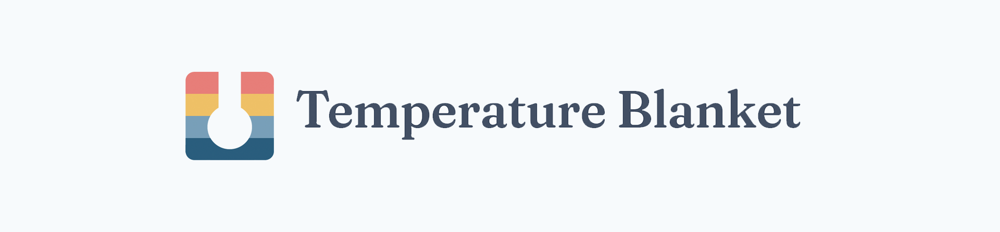

### 🌤️ Weather Data + 🧶 Art!

Website: **[temperature-blanket.com](https://temperature-blanket.com)**

**New:** Try out the next version of the website at **[next.temperature-blanket.com](https://next.temperature-blanket.com)**

Visualize your city's historical climate data, create color gauges, and preview your pattern for your crochet or knitting temperature project. Save your project in your browser and as a URL, and download project information in PDF, CSV, and PNG files.

Built with:

- [Svelte 5](https://svelte.dev/)
- [Sveltekit 2](https://svelte.dev/)
- [Skeleton 3](https://github.com/skeletonlabs/skeleton)
- [Tailwind 4](https://github.com/tailwindlabs/tailwindcss)

What's new in the latest version?

- Fullscreen color editor
- Option to show color details in the weather table
- Move colors directly in the gauge editor

## 🚀 Getting Started

To run this site locally on your computer for development, [clone this repository](https://docs.github.com/en/repositories/creating-and-managing-repositories/cloning-a-repository) and create a `.env` file. Additionally, in order for certain features to work you'll need to register for some free API services.

> 💡 [Node.js](https://nodejs.org/en/download/package-manager) must be installed on your machine.

1. Copy the [.env.example](.env.example) file to a new file named `.env` in the root directory of your project.

2. For the location search features to work, [register for a free GeoNames username](http://www.geonames.org/login). You will then receive an email with a confirmation link and after you have confirmed the email you can enable your account for the webservice on [your account page](http://www.geonames.org/manageaccount). In your `.env` file, set `SECRET_GEONAMES_USERNAME` to your GeoNames username. The free plan gets 10,000 credits per month.

3. For the Meteostat weather data features to work, [sign up for the free Meteostat Base plan through RapidAPI](https://rapidapi.com/meteostat/api/meteostat/pricing). In your `.env` file, set `SECRET_METEOSTAT_API_KEY` to your key from RapidAPI. The free Base plan gets 500 requests per month.

## 🛠️ Developing

Install dependencies:

```bash
npm install
```

Start a development server:

```bash
npm run dev
```

### ✅ Testing

First build the app (to generate cloudflare \_routes.json file)

```bash
npm run build
```

Test frontend pages and functions

```bash
npm run test
```

Test internal api routes (for the Yarn Colorways API)

```bash
npm run test:api
```

## 🙌 Acknowledgments

Thanks for the support and feedback from users like you!

Temperature-blanket.com gets data from several APIs:

- **[GeoNames](https://www.geonames.org/)** for location data

- **[Open-Meteo](https://open-meteo.com)** for weather data

- **[Meteostat](https://meteostat.net)** for weather data

# 📚 Documentation & Notes

### 🗄️ Database

Temperature-blanket.com uses a backend database in the form of a headless Wordpress site on a separate domain to store user-created gallery pages.

<details>
<summary>View Details</summary>

> ℹ️ The information below is intended for documentation only. You can test and develop this project locally without setting up your own backend database.

Here are the steps for setting up the headless Wordpress site:

- Install Wordpress on a separate domain.
- I use the following plugins
  - [EWWW Image Optimizer](https://wordpress.org/plugins/ewww-image-optimizer/) - To compress and optimize project preview images
  - [Redirection](https://wordpress.org/plugins/redirection/) - To redirect the headless Wordpress home page to the temperature-blanket.com site, and to redirect project pages to their corresponding gallery pages on temperature-blanket.com.
  - Temperature Blanket Custom Plugin - I created a Wordpress plugin which handles the necessary setup and allows for creation of project gallery pages through a custom REST endpoint.
  - [Wordfence](https://wordpress.org/plugins/wordfence/) - For general site security
  - [Wordpress Popular Posts](https://wordpress.org/plugins/wordpress-popular-posts/) - For tracking popular projects
  - [WP-GraphQL](https://wordpress.org/plugins/wp-graphql/) - For interacting with the Wordpress backend
- Add the following line to `wp-config.php`:

```
define('PROJECT_CREATION_AUTH_KEY', 'auth_key');
```

- In this project's `.env` file, `SECRET_WORDPRESS_PROJECT_CREATION_AUTH_KEY` should be the same `'auth_key'` value. Without the correct auth key, the Wordpress site won't accept POST requests for new project gallery pages.

> 💡 When developing locally, POST requests to create new temperature blanket project gallery pages will be rejected. This is normal, because you don't have the necessary authentication key.

</details>

### 💾 Local Storage

Various site settings and data are stored in the browser.

<details>
<summary>View Details</summary>

| Key Name              | Description                                                | Default Value                                                                                                                                          | Possible Values                                                     | Version Added\* |
| --------------------- | ---------------------------------------------------------- | ------------------------------------------------------------------------------------------------------------------------------------------------------ | ------------------------------------------------------------------- | --------------- |
| preferences           | User preferences object                                    | `{ disableToastAnalytics: false, theme: { id: 'classic', mode: 'system',},layout: 'list',} forecast: {unit: 'metric', hourFormat: 24, locations: [],}` | [`Preferences`](src/lib/state/persisted-state.svelte.ts)            | < 5.0.0         |
| projects              | Projects the user has saved                                | `[]`                                                                                                                                                   | array of [`SavedProject`](src/lib/types/project-types.d.ts) objects | < 3.28.3        |
| [/weather]units       | Units for the weather forecast page                        | `imperial`                                                                                                                                             | `imperial`, `metric`                                                | < 3.28.3        |
| [/weather]hour_format | Time format for the weather forecast page                  | `12`                                                                                                                                                   | `12`, `24`                                                          | < 3.28.3        |
| [/weather]locations   | Locations the user has added for the weather forecast page | `[]`                                                                                                                                                   | array of [`Location`](src/lib/types/location-types.d.ts) objects    | < 3.28.3        |

_\*Items with a < before the version means sometime before that version, I'm not sure exactly when because I wasn't keeping track before version 3.28.3._

</details>
